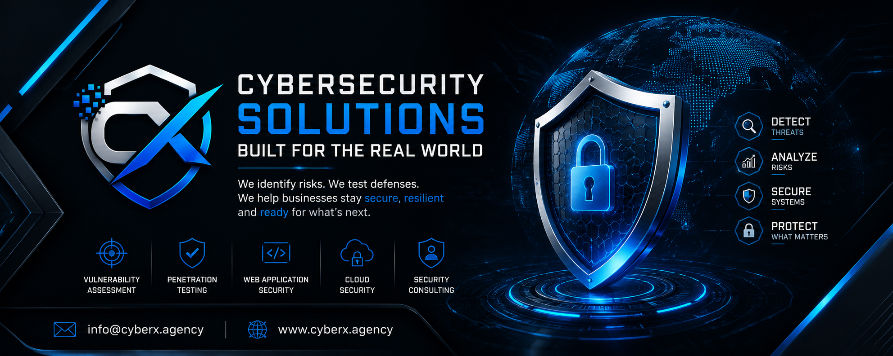

<div align="center">



<br>

### CYBERSECURITY • VULNERABILITY ASSESSMENT • PENETRATION TESTING

[](https://cyberx.agency)
[](https://www.linkedin.com/company/cyberx-agency/)
[](mailto:info@cyberx.agency)

</div>

---

# 🛡️ About CyberX.agency

**CyberX.agency** is a cybersecurity services company focused on helping organizations identify, understand, and reduce security risks across their digital environments.

Our initial specialization is **Website Vulnerability Assessment and Penetration Testing (VAPT)**, with a strong focus on internet-facing websites, web applications, APIs, authentication mechanisms, authorization controls, security configurations, and application-level weaknesses.

We combine structured security assessment methodologies, manual testing, technical analysis, evidence-based reporting, and practical remediation guidance to help businesses better understand their security posture.

Cybersecurity is not simply about finding vulnerabilities.

It is about understanding **risk**.

It is about knowing:

> **What can go wrong?**
>
> **How serious is it?**
>
> **What could it mean for the business?**
>
> **What should be fixed first?**

That is the approach we aim to bring to every security assessment.

---

# 🎯 Our Mission

> **Identify Risk. Communicate It Clearly. Build Stronger Security.**

Our mission is to make cybersecurity assessment more practical, transparent, and useful for organizations of different sizes.

We believe that a good security assessment should not leave a business owner with a complicated list of technical findings and no clear direction.

Instead, security findings should be translated into meaningful information that allows organizations and their technical teams to make informed decisions.

### We help organizations:

- 🔎 Discover security weaknesses
- 🧠 Understand the significance of identified risks
- 📊 Prioritize vulnerabilities based on risk
- 🛡️ Improve security controls
- 🔐 Strengthen applications and digital platforms
- 📝 Understand security findings through clear reporting
- 🔧 Make informed remediation decisions

---

# 🌐 Our Core Services

## 🔎 Website Vulnerability Assessment

We assess websites and internet-facing applications to identify potential security weaknesses within the agreed assessment scope.

Areas may include:

- Security misconfigurations
- Authentication weaknesses
- Authorization issues
- Session management
- Input validation
- Information disclosure
- File handling
- Application security controls
- Client-side security
- API exposure
- Business logic weaknesses

---

## 🛡️ Web Application Penetration Testing

Penetration testing goes beyond automated vulnerability scanning.

Where authorized and appropriate, we perform controlled security testing to validate whether identified weaknesses can realistically affect an application or its underlying business functions.

Testing may cover:

- Authentication mechanisms
- Authorization and access control
- Session security
- Input handling
- Injection vulnerabilities
- Cross-site scripting
- Access control weaknesses
- File upload functionality
- API endpoints
- Business logic
- Security configuration
- Sensitive information exposure

The objective is to provide organizations with a clearer understanding of their **real-world security exposure**.

---

## 🔐 Authentication & Authorization Testing

Modern applications depend heavily on identity and access controls.

Our security testing may examine areas such as:

- Login mechanisms
- Password policies
- Session handling
- Account recovery
- Multi-factor authentication controls
- Role-based access
- Privilege boundaries
- Horizontal access control
- Vertical privilege escalation
- Access to restricted functionality

---

## 🔌 API Security Assessment

APIs are an increasingly important part of modern applications.

Where APIs fall within the agreed scope, testing may examine:

- Authentication
- Authorization
- Access control
- Input validation
- API exposure
- Excessive data exposure
- Rate limiting
- Security configuration
- Endpoint behavior
- Object-level authorization

---

# 🧪 Our Security Assessment Methodology

A professional security assessment begins before technical testing.

We believe every engagement should establish clear:

**Authorization → Scope → Rules of Engagement → Testing → Evidence → Analysis → Reporting → Remediation**

A typical assessment lifecycle can be represented as:

```text
                ┌─────────────────────┐
                │  01. Authorization  │
                └──────────┬──────────┘
                           │
                           ▼
                ┌─────────────────────┐
                │  02. Scope & Rules  │
                │    of Engagement    │
                └──────────┬──────────┘
                           │
                           ▼
                ┌─────────────────────┐
                │ 03. Reconnaissance  │
                └──────────┬──────────┘
                           │
                           ▼
                ┌─────────────────────┐
                │ 04. Attack Surface  │
                │       Mapping       │
                └──────────┬──────────┘
                           │
                           ▼
                ┌─────────────────────┐
                │ 05. Vulnerability   │
                │      Discovery      │
                └──────────┬──────────┘
                           │
                           ▼
                ┌─────────────────────┐
                │ 06. Security        │
                │     Validation      │
                └──────────┬──────────┘
                           │
                           ▼
                ┌─────────────────────┐
                │ 07. Risk Analysis   │
                └──────────┬──────────┘
                           │
                           ▼
                ┌─────────────────────┐
                │ 08. Evidence &      │
                │    Documentation    │
                └──────────┬──────────┘
                           │
                           ▼
                ┌─────────────────────┐
                │ 09. Security Report │
                └──────────┬──────────┘
                           │
                           ▼
                ┌─────────────────────┐
                │ 10. Remediation     │
                │      Guidance       │
                └─────────────────────┘
